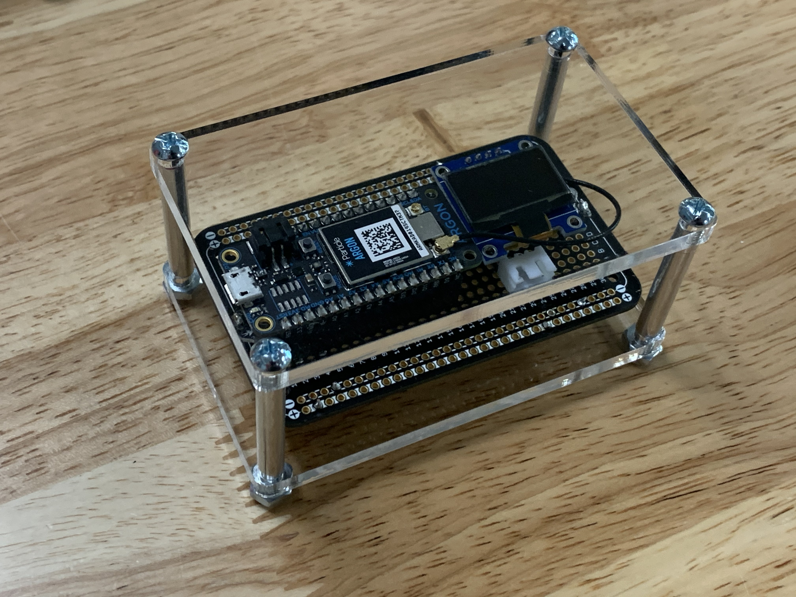

# IoT Bootcamp: Liquid Prep Soil Moisture Monitor

### The goal of this project is to develop a smart, internet connected soil moisture sensor to be integrated into IBM's Liquid Prep app. To do this, recent IoT Bootcamp graduates developed code for Particle Gen 3 microcontrollers to communicate analog data from a capacitive soil moisture sensor data via bluetooth and WiFi. The Adafruit BlueFruit app for iOS and Android is used to receive UART bluetooth data. Data is visualized on an Adafruit.io dashboard which allows the user to track soil moisture over time.

## The Platform

The Soil Moisture probe was developed on Particle's Argon development platform. The featherwing-compatible development board was selected for its integrated Wi-Fi and bluetooth connectivity, which allows for multiple avenues of data transfer between the probe and the Liquid-Prep application. In addition, the Argon has a readily available LiPo battery connection to enable the device to work in a fully wireless mode. 

Coding for the current iteration of the soil moisture probe was done using the Particle Workbench extension for VSCode.

## The Soil Probe

The  Moisture Probe is created around a simple capacitive soil moisture sensor ( <$3 USD). It is wired into an analog input on of the Argon system. In addition, a low cost display is added to the system to allow a user to directly read the soil moisture measuremet. The soil moisture sensor value is mapped to a percentage - 0% when in dry air, 100% when submerged in water. In practice, the value will be somewhere in between. The desired value will be dependant on the plant and soil type.

* The Code: SoilSensorCal collects the calibration factors for the soil moisture probe and stores them in the Particle's EEPROM.

## Device Hardware

### Parts

1. Particle Argon Wi-Fi Development Board - [Particle Argon](https://store.particle.io/collections/wifi/products/argon)
2. Capacative soil moisture sensor - [Soil moisture sensor](https://www.amazon.com/PAGOW-Capacitive-Sensitivity-Corrosion-Resistant/dp/B08C56GYSB/ref=asc_df_B08C56GYSB/?tag=hyprod-20&linkCode=df0&hvadid=475809787591&hvpos=&hvnetw=g&hvrand=13217261096924105848&hvpone=&hvptwo=&hvqmt=&hvdev=c&hvdvcmdl=&hvlocint=&hvlocphy=9030461&hvtargid=pla-1046214210147&psc=1)
3. OLED display - [OLED](https://www.amazon.com/Display-0-96inch-SSD1306-Arduino-Raspberry/dp/B0871KW7BD/ref=asc_df_B0871KW7BD/?tag=hyprod-20&linkCode=df0&hvadid=459772643279&hvpos=&hvnetw=g&hvrand=8938130720117891581&hvpone=&hvptwo=&hvqmt=&hvdev=c&hvdvcmdl=&hvlocint=&hvlocphy=9030461&hvtargid=pla-955947987978&psc=1)
4. 3.7V battery with  2-pin JST-PH connection - [Battery](https://www.adafruit.com/product/2011?gclid=CjwKCAjw_JuGBhBkEiwA1xmbRZznc2GC1adzDu5trw1C1eiGxD09blxWQx84KcmvJtDXtWI3MnGMpRoCHhAQAvD_BwE)
5. Mounting hardware such as protective case or probe(varies on use case).

### Setup
1. Wire both the soil moisture sensor and OLED as shown in schematic.
2. Affix moisture sensor to a soil penetration probe as seen below or other appropriate hardware depending on use case. 
3. Connect the Argon into a computer using a micro-USB cable. 
4. Follow the following Particle documentation to set the device and connect it to Wi-Fi
[ParticleDocumentation](https://support.particle.io/hc/en-us/articles/360045547634-How-can-I-set-up-my-Argon-or-Boron-via-USB-)
5. After setup, use Visual Studio Code to compile and upload the "BLEDashboardSensor" application.

### Soil penentration device

The capacitive sensor is attached to a metal penetration that can be pushed into the soil by stepping on a platorm near the base. The pentration device was cut from 0.25 inch steel on a Torchmate CNC Plasma Table. The /Torchmate folder in this respository includes the files to plasma cut the penetration device. 

### Electronics holder
Additionally, the students designed and 3D printed a smartphone holder that can be placed at the top of the penetration pole, holding the electronics and display. The .stl files for the 3D prints are included the /3D Print folder in this repository.

## Data Transfer

### BLE
The Argon microcontroller sends the soil moisture data over BLE via a UART stream. This data can be read by a future Liquid-Prep application allowing it directly get data from the probe. Sample data is seen below using the Bluefruit smartphone app.

### Adafruit.io
Periodically, the Argon microcontroller sends the soil moisture data to an Adafruit.io dashboard via its cellular connection. This allows for easy visualization of the moisture data.  

### Morse Code
Additionally, the "LightCommunication" application allows users to read data from the Argon microcontroller using the Morse Cam app for iOS. The purpose of this application is to demonstrate the ability to transfer data using nontraditional methods. This requires an additonal LED light such an Adafruit NeoPixel LED Ring. [NeoPixel](https://www.adafruit.com/product/1463?gclid=CjwKCAjw_JuGBhBkEiwA1xmbRQ8KXl8inKbKAIjFVllt0GIqpISXa4G-AfsbOtpaIZPw4mE5cVrjJhoC324QAvD_BwE)

[MorseCam](https://apps.apple.com/us/app/morse-cam/id1538642469)

## About the Students

The original work was created by students of Central New Mexico Community College's Internet of Things Deep Dive bootcamp (www.cnm.edu/deepdive). Since graduating, the two students have continued to work with IBM's Call for Code Liquid-Prep team to add functionality and connectivity, as well as improve upon the physical components. 

### Janel Sanchez

A student from the Deep Dive Internet of Things Cohort 3, which allowed her the opportunity to learn the fundamentals of creating and coding smart connected devices. Coming from a medical background and a strong passion to help in her community, Janel seeks to find opportunities that aid in kindness and positive change. By taking the bootcamp she was able to incorporate new STEM skills that she hopes to pass on to future generations.

In this project she was able to contribute in the planning of the project as well as design from the beginning to end stages. From incorporation code previously learned in the bootcamp to cutting and welding metal pieces together and powder coating them, she enjoyed being able to be part of a team that is set out to make a difference in the world.

### Christian Chavez

Christian is a recent graduate of CNM Ingenuity's Internet of Things Coding and Hardware Design bootcamp. He is currently working as a Technical Resident at CNM's Technology Solutions Labs under the direction of Dr. Brian Rashap. Christian helped to write code and design hardware for the Liquid Prep Soil Moisture Project.

### Brian Rashap (Professor)

Janel and Christian worked on this project under the guidance of Dr. Brian Rashap. Brian is a workforce development instructor focused on training the next generation of Internet of Things professionals. 
Copyright CNM 2021
##
##
##

Copyright CNM Ingenuity 2021
