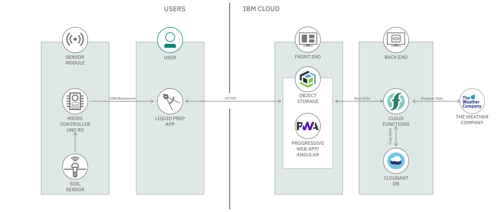
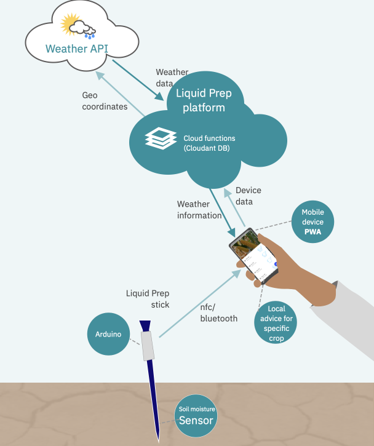

# Liquid Prep

  

Liquid Prep offers an end-to-end solution for farmers who want to optimize water usage, conserve resources and maximize crop yield, especially in times of drought. It is designed for farmers worldwide who want or need access to advanced agricultural advice.

By using an intuitive mobile app, local soil sensors, and backend service in IBM Cloud, farmers can be better informed on how to use limited water supplies and increase their chances of growing healthy crops, even on small plots of land.

## Solution Details

The [Call for Code 2019](https://callforcode.org/) Global Challenge asked teams of developers, designers, data scientists and business analysts to build solutions that significantly improve preparedness for natural disasters and accelerate relief when they hit. That year, the team answered the call and developed a solution.

> Learn more about the [history, testing, and ecosystem of Liquid Prep](BACKGROUND.md)

Farmers are key food providers, and their crops are essential to human survival and prosperity. Natural disasters, such as droughts and floods, affect farmers and all of us. With increasing fluctuations in global climate, we believe that this is an important challenge to tackle.

**Liquid Prep** is an end-to-end solution for farmers looking to optimize their usage of water, especially in times of drought. The following depicts the Liquid Prep solution architecture:

  

  

#### [Soil Sensor Module](https://github.com/Liquid-Prep/LiquidPrep-Hardware)

The Soil Moisture Sensor Module measures the soil moisture level and transmits data to Liquid Prep App when the app is connected to the sensor module.

#### [Liquid Prep App](https://github.com/Liquid-Prep/LiquidPrep-App)

The Liquid Prep App is designed and developed for users/farmers to easily understand, interact and get guidance for crops in their current location. The app interacts with the Soil Moisture Sensor Module to retrieve soil moisture data, and with the IBM Cloud Backend Service to fetch weather data and crop data to generate watering advice for the selected crop.

#### [Backend Service](https://github.com/Liquid-Prep/LiquidPrep-Backend)

The Backend Service exposes APIs handled by [Cloud Functions](https://cloud.ibm.com/docs/openwhisk) that interact with [Cloudant Database](https://www.ibm.com/cloud/cloudant) for crop data and [The Weather Company APIs](https://business.weather.com/) for weather data. The Backend Service is hosted on [IBM Cloud](https://www.ibm.com/cloud).

#### The Weather Company

The weather data for a given location is being requested to [The Weather Company APIs](https://business.weather.com/) from the Backend Service.

## Get Started

- Project Setup  
  The Liquid Prep solution has three main components with setup guidance for each.
  - [Soil Moisture Sensor Device Setup](https://github.com/Liquid-Prep/LiquidPrep-Hardware#liquid-prep---soil-sensor)
  - [IBM Cloud Backend Service Setup](https://github.com/Liquid-Prep/LiquidPrep-Backend#liquid-prep---backend-service)
  - [Liquid Prep App Setup](https://github.com/Liquid-Prep/LiquidPrep-App#liquid-prep---app)
- [Project Roadmap](#project-roadmap)
- [Contributing](#contributing)

## Project Roadmap

The Liquid Prep solution comprises a highly visual mobile web application, a hardware sensor to measure soil moisture, a backend data service to power the app, and the IBM Cloud platform for accessing weather and crop data. Our future roadmap adds functionality to the Liquid Prep platform by:

1. Localizing the app.
2. Adding more crop data.
3. Considering soil properties for better watering advice.

The goal is to help farmers globally produce the maximum yield with the least amount of water, using real-time information to improve sustainability and build resiliency to climate change.

Participation is welcome from software developers, designers, testers, agronomists/agri experts/soil experts, IoT engineers, researchers, students, farmers, and anyone that can contribute to the quality and value of the solution for the farming community worldwide.

Key areas of interest include:
- mobile app localization
- soil properties for the improvement of watering advice
- project documentation updates
- software and hardware testing
- in-depth research
- addition of crop data to the database

## Contributors

## Contributing

Please read [CONTRIBUTING.md](CONTRIBUTING.md) for details on our code of conduct, areas where we'd like to see community contributions, and the process for submitting pull requests to the project.

## Technical Steering Committee

[The Liquid Prep Technical Charter](Liquid-Prep-Technical-Charter.pdf) and the [CONTRIBUTING.md](CONTRIBUTING.md) file contain TSC details.

### Public meetings

Thursdays at 4:30pm ET. [Join us on Zoom](https://us05web.zoom.us/j/9124577210?pwd=NDFUV1EvdGFLZWpQb3ZYcm10ZEpxdz09).

## License

Copyright 2019-2025 Liquid Prep

Unless otherwise noted, this project is licensed under the Apache 2 License - see the [LICENSE](LICENSE) file for details.
