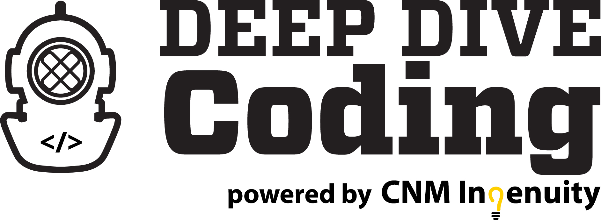

# IoT Bootcamp: Liquid Prep Soil Moisture Monitor

### The goal of this project is to develop a smart, internet connected soil moisture sensor to be integrated into IBM's Liquid Prep app. To do this, recent IoT Bootcamp graduates developed code for Particle Gen 3 microcontrollers to communicate analog data from a capacitive soil moisture sensor data via bluetooth and WiFi. The Adafruit BlueFruit app for iOS and Android is used to receive UART bluetooth data. Data is visualized on an Adafruit.io dashboard which allows the user to track soil moisture over time.

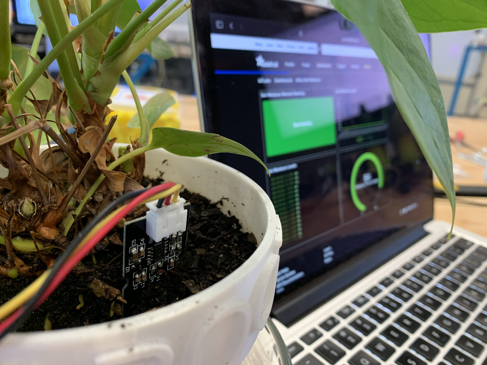

## The Platform

The Soil Moisture probe was developed on Particle's Argon development platform. The featherwing-compatible development board was selected for its integrated Wi-Fi and bluetooth connectivity, which allows for multiple avenues of data transfer between the probe and the Liquid-Prep application. In addition, the Argon has a readily available LiPo battery connection to enable the device to work in a fully wireless mode.

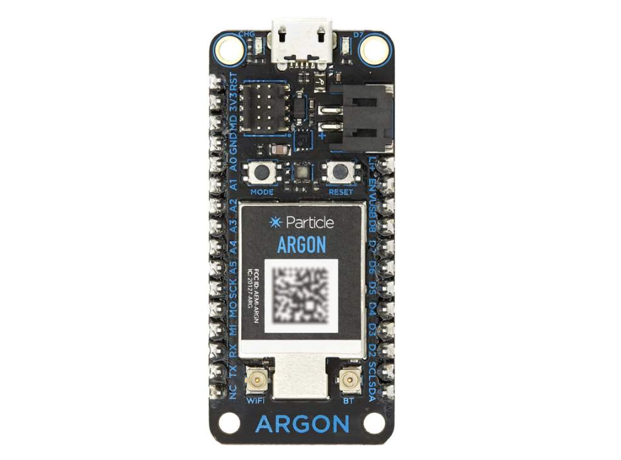

Coding for the current iteration of the soil moisture probe was done using the Particle Workbench extension for VSCode.

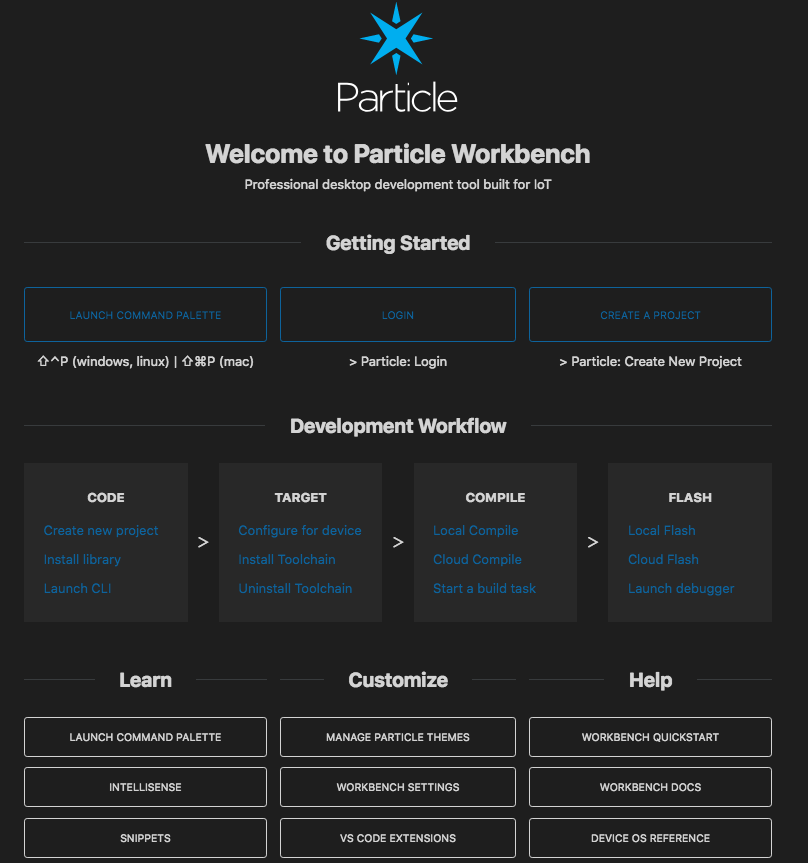

## The Soil Probe

The Moisture Probe is created around a simple capacitive soil moisture sensor ( <$3 USD). It is wired into an analog input on of the Argon system. In addition, a low cost display is added to the system to allow a user to directly read the soil moisture measurement. The soil moisture sensor value is mapped to a percentage - 0% when in dry air, 100% when submerged in water. In practice, the value will be somewhere in between. The desired value will be dependent on the plant and soil type.

- The Code: SoilSensorCal collects the calibration factors for the soil moisture probe and stores them in the Particle's EEPROM.

### Soil Penetration Device

The capacitive sensor is attached to a metal penetration that can be pushed into the soil by stepping on a platform near the base. The penetration device was cut from 0.25 inch steel on a Torchmate CNC Plasma Table. The `./Torchmate` folder in this repository includes the files to plasma cut the penetration device.

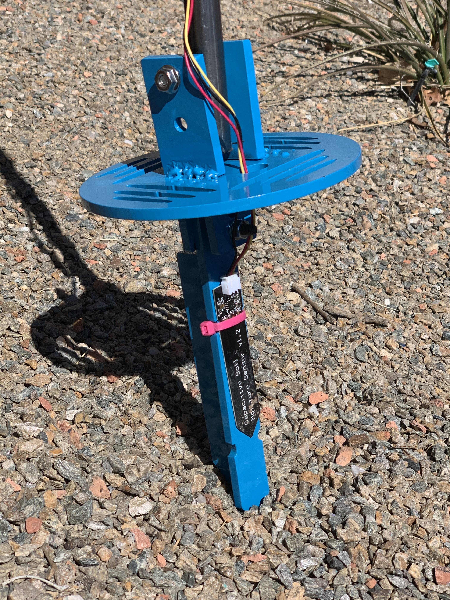

### Electronics holder

Additionally, the students designed and 3D printed a smartphone holder that can be placed at the top of the penetration pole, holding the electronics and display. The .stl files for the 3D prints are included the /3D Print folder in this repository.

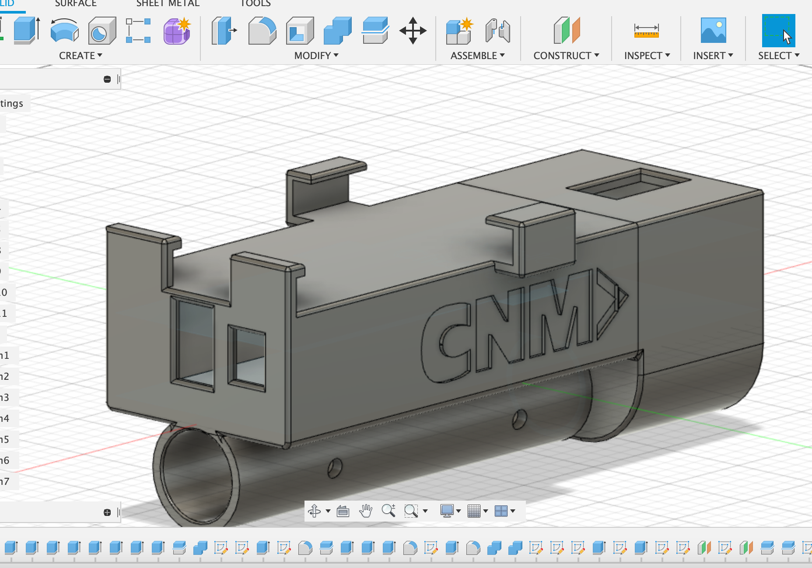

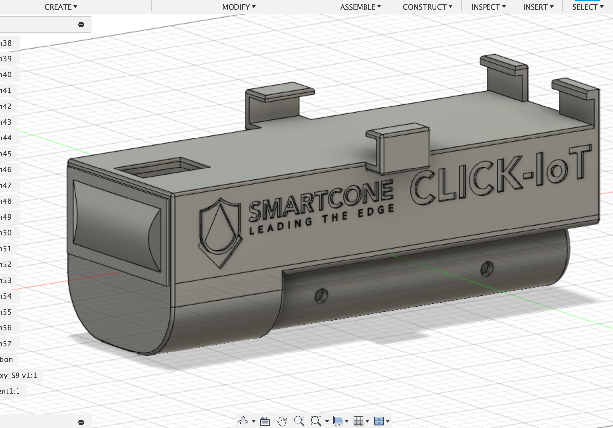

## Data Transfer

### BLE

The Argon microcontroller sends the soil moisture data over BLE via a UART stream. This data can be read by a future Liquid-Prep application allowing it directly get data from the probe. Sample data is seen below using the Bluefruit smartphone app.

### Adafruit.io

Periodically, the Argon microcontroller sends the soil moisture data to an Adafruit.io dashboard via its cellular connection. This allows for easy visualization of the moisture data.

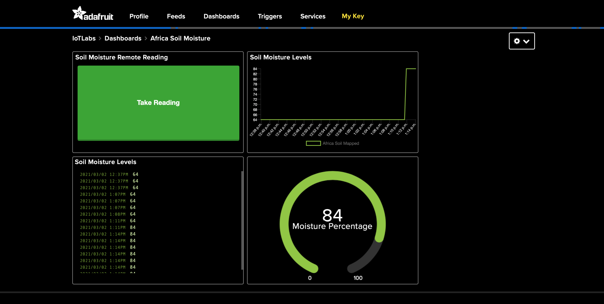

### Morse Code

Additionally, the "LightCommunication" application allows users to read data from the Argon microcontroller using the Morse Cam app for iOS. The purpose of this application is to demonstrate the ability to transfer data using non-traditional methods. This requires an additional LED light such an Adafruit NeoPixel LED Ring. [NeoPixel](https://www.adafruit.com/product/1463?gclid=CjwKCAjw_JuGBhBkEiwA1xmbRQ8KXl8inKbKAIjFVllt0GIqpISXa4G-AfsbOtpaIZPw4mE5cVrjJhoC324QAvD_BwE)

[MorseCam](https://apps.apple.com/us/app/morse-cam/id1538642469)

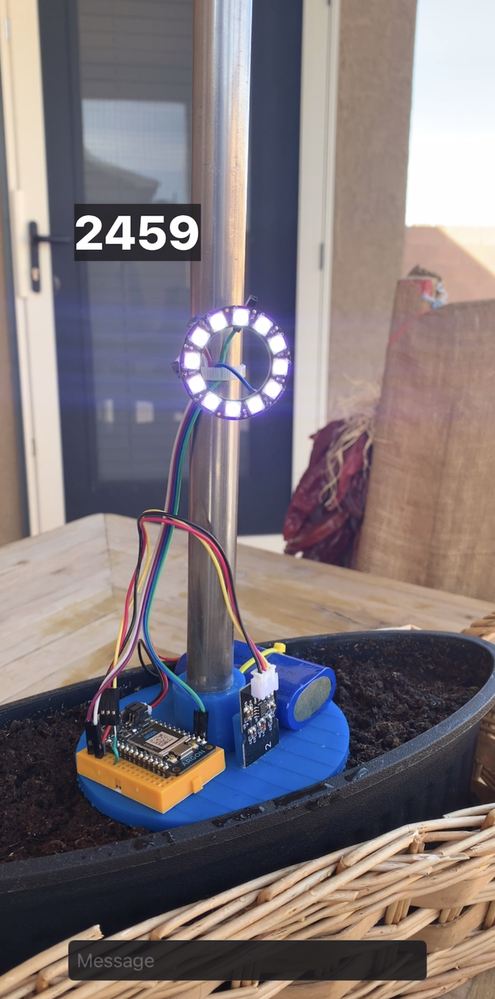

## About the Students

This original work was created by students of Central New Mexico Community College's Internet of Things Deep Dive bootcamp (www.cnm.edu/deepdive). Since graduating, the two students have continued to work with IBM's Call for Code Liquid-Prep team to add functionality and connectivity, as well as improve upon the physical components.

### Janel Sanchez

A student from the Deep Dive Internet of Things Cohort 3, which allowed her the opportunity to learn the fundamentals of creating and coding smart connected devices. Coming from a medical background and a strong passion to help in her community, Janel seeks to find opportunities that aid in kindness and positive change. By taking the bootcamp she was able to incorporate new STEM skills that she hopes to pass on to future generations.

In this project she was able to contribute in the planning of the project as well as design from the beginning to end stages. From incorporation code previously learned in the bootcamp to cutting and welding metal pieces together and powder coating them, she enjoyed being able to be part of a team that is set out to make a difference in the world.

### Christian Chavez

Christian is a recent graduate of CNM Ingenuity's Internet of Things Coding and Hardware Design bootcamp. He is currently working as a Technical Resident at CNM's Technology Solutions Labs under the direction of Dr. Brian Rashap. Christian helped to write code and design hardware for the Liquid Prep Soil Moisture Project.

### Brian Rashap (Professor)

Janel and Christian worked on this project under the guidance of Dr. Brian Rashap. Brian is a workforce development instructor focused on training the next generation of Internet of Things professionals.

## Device Hardware and Setup Guide

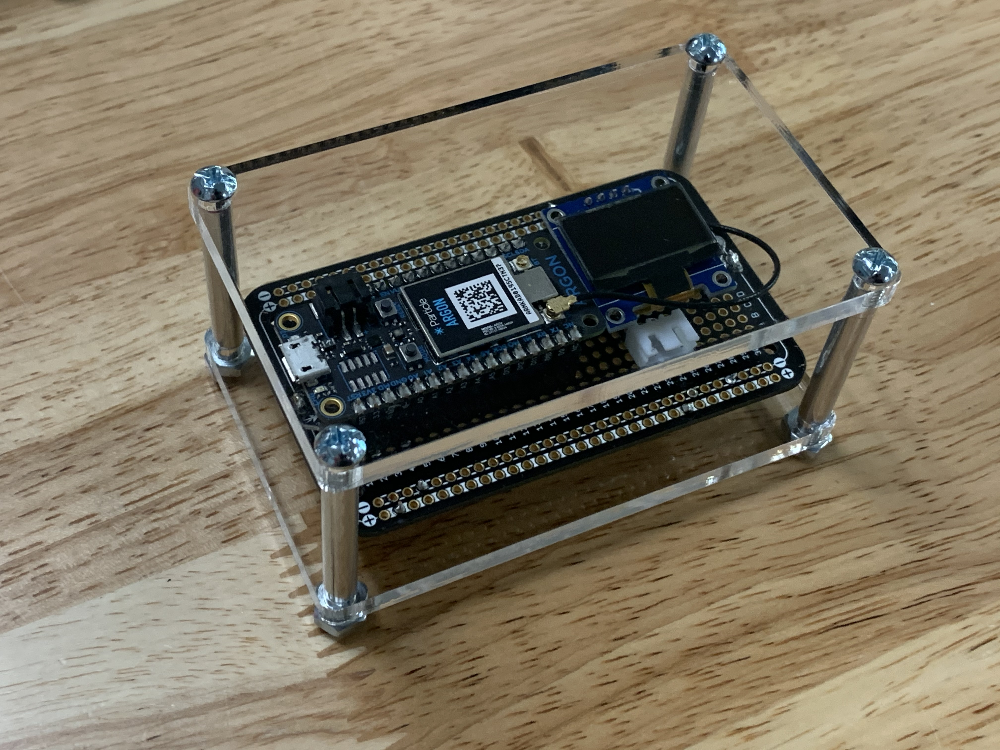

### Parts

1. Particle Argon Wi-Fi Development Board (Available from store.particle.io)

2. Capacitive soil moisture with jumper wires (Available from gikfun.com or Amazon)

3. OLED Display - Adafruit SSD1306 (Available from Mouser.com)

4. Solderless breadboard or solderboard (Available from Amazon or a variety of electronic retailers)

5. 3.7V battery with 2-pin JST-PH connection (Available from Amazon or a variety of electronic retailers)

6. 22 gauge jumper wire
   (Available from Amazon or a variety of electronic retailers)

7. Materials for protective case(varies by use case, see examples)

### Setup

1. Wire both the soil moisture sensor and OLED as shown in schematic and described below.

Moisture Sensor:
AOUT - A3 pin on Argon
VCC - 3.3V power supply on Argon
GND - GND on Argon

OLED:
SCL - SCL on Argon
SDA - SDA on Argon
VCC - 3.3V power supply on Argon
GND - GND on Argon

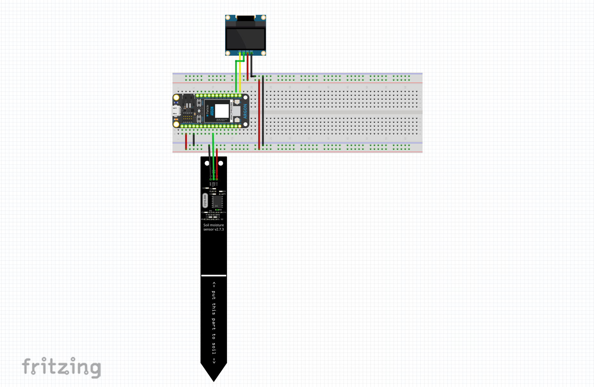

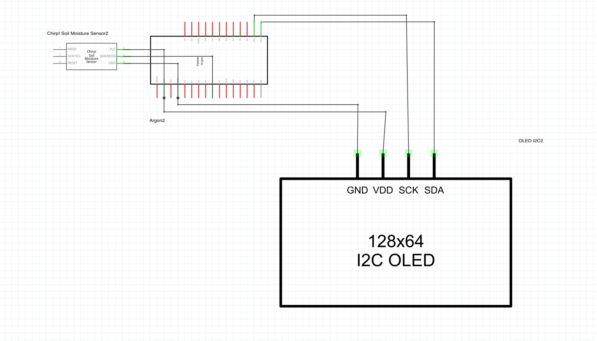

2. Build case to protect microcontroller and moisture probe depending on use case.

### Creating an Adafruit.io Dashboard:

1. Visit Adafruit.io and create a free user account. https://accounts.adafruit.com/users/sign_up

2. Keep note of your Username and Active Key.

### Software Setup

1. Clone the Liquid Prep GitHub repository: https://github.com/Liquid-Prep/Liquid-Prep.git

2. Install Visual Studio Code: [VS Code Download](https://code.visualstudio.com)

3. Install the Particle Workbench for Visual Studio Code. Select all defaults during install.
   [Particle Workbench Download](https://docs.particle.io/quickstart/workbench/)

4. Use the following documentation to set up the Particle Argon to a Particle account and to connect the device to Wi-Fi. [Particle Setup Documentation](https://support.particle.io/hc/en-us/articles/360045547634-How-can-I-set-up-my-Argon-or-Boron-via-USB-)

5. Using Visual Studio Code, open the BLEDashboardSensor file from the CNM folder within the GitHub repository.

6. Click “File” then “New File”. Save this file as “credentials.h”

7. Navigate to the “My Key” tab within the Adafruit.io account.

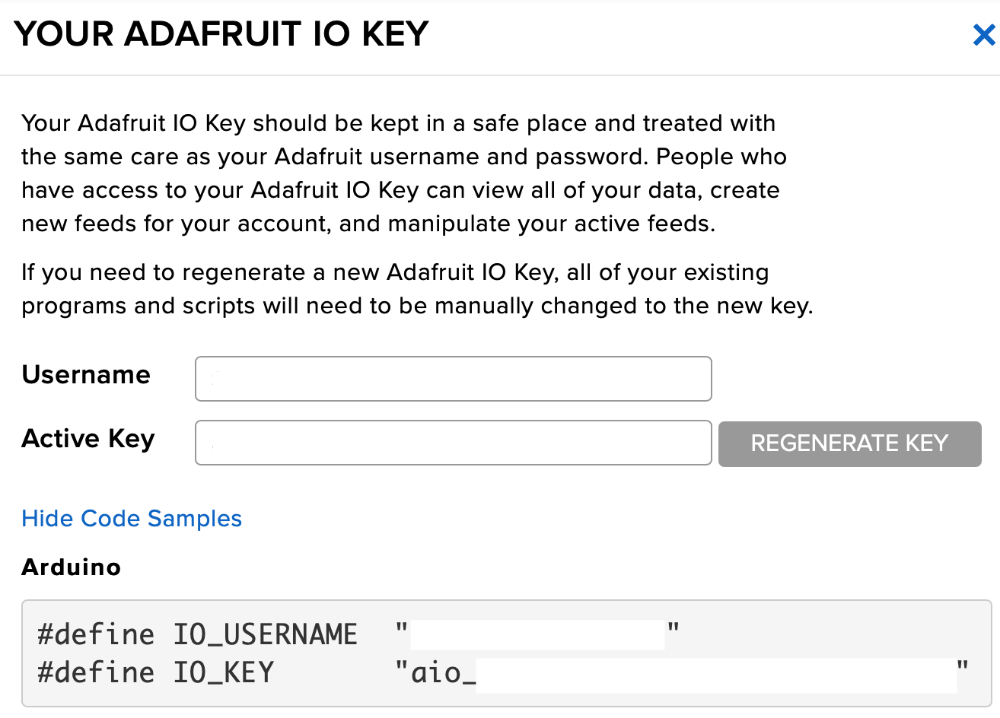

8. Copy the Arduino code sample with #define AIO_USERNAME and AIO_KEY then paste into the “credentials.h” file. Also define the AIO_SERVER and AIO_SERVERPORT as shown in the example below.

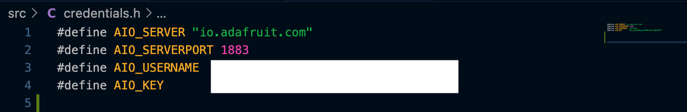

9.  Ensure Particle Argon is plugged into the computer via USB. Using the toolbar in the top right corner, first Compile and then Flash code to the device.

## Using the Device:

1. After ensuring all previous steps are complete, supply power to the device using either a battery or USB.

2. Wait for the device to power on, then moisture data will be updated in real time on the OLED display, sent to the Adafruit.io Dashboard, and be sent via Bluetooth to the Adafruit Bluefruit app.

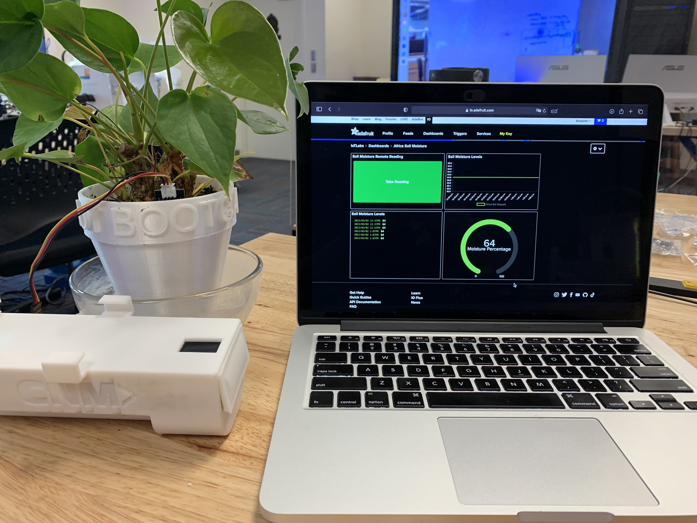

### Using Bluetooth Features:

1. Download the Bluefruit Connect app for iOS or Android.

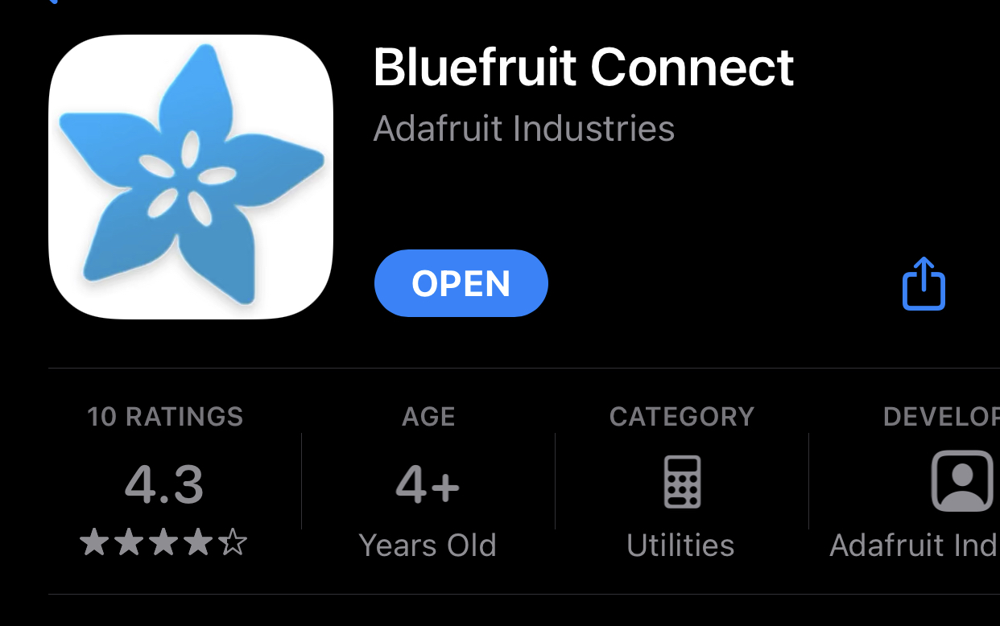

2. Open the app and select the Argon device from the list.

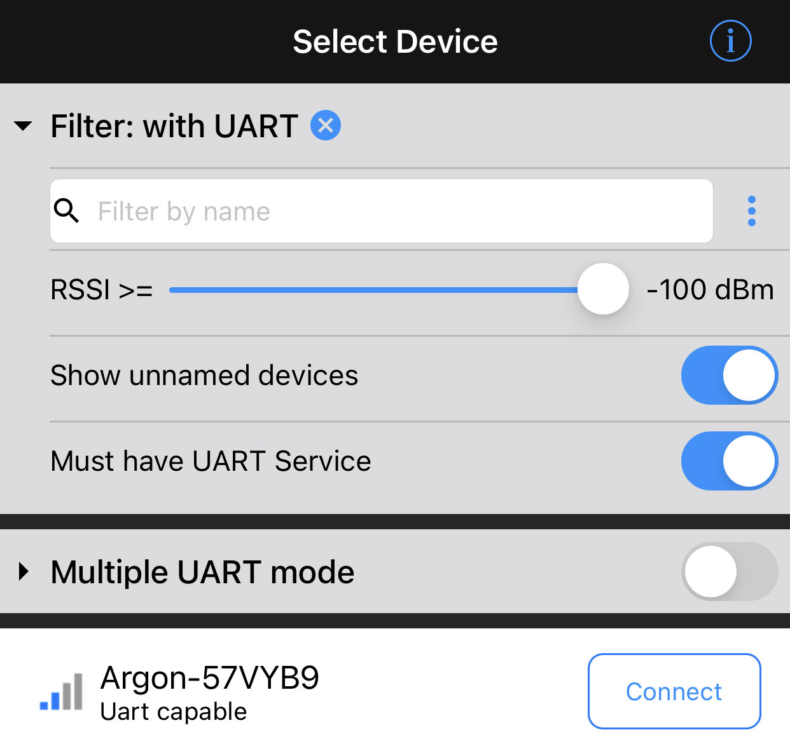

3. UART data will stream in real time to the mobile app.

Copyright CNM 2021

##

##

##

Copyright CNM Ingenuity 2021
